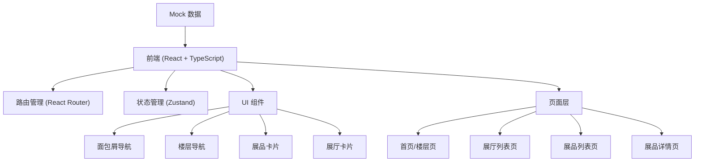

## 1. 架构设计



## 2. 技术选型

- **前端框架**：React@18 + TypeScript
- **构建工具**：Vite@5
- **路由管理**：react-router-dom@6
- **状态管理**：zustand@4
- **样式方案**：TailwindCSS@3
- **图标库**：lucide-react
- **数据层**：TypeScript 类型定义 + Mock 数据（前端内置）

## 3. 目录结构

```
src/
├── components/          # 可复用组件
│   ├── Breadcrumb.tsx   # 面包屑导航
│   ├── FloorNav.tsx     # 楼层导航
│   ├── ExhibitCard.tsx  # 展品卡片
│   ├── HallCard.tsx     # 展厅卡片
│   └── ImageFallback.tsx # 图片降级组件
├── pages/               # 页面组件
│   ├── FloorPage.tsx    # 首页/楼层页
│   ├── HallListPage.tsx # 展厅列表页
│   ├── ExhibitListPage.tsx # 展品列表页
│   └── ExhibitDetailPage.tsx # 展品详情页
├── store/               # 状态管理
│   └── museumStore.ts   # 博物馆数据 store
├── data/                # Mock 数据
│   └── museumData.ts    # 楼层、展厅、展品数据
├── types/               # 类型定义
│   └── museum.ts        # 数据模型定义
├── App.tsx              # 应用入口
└── main.tsx             # 渲染入口
```

## 4. 路由定义

| 路由路径 | 页面 | 说明 |
|----------|------|------|
| `/` | 楼层首页 | 展示所有楼层导航 |
| `/floor/:floorId` | 展厅列表页 | 展示指定楼层的所有展厅 |
| `/floor/:floorId/hall/:hallId` | 展品列表页 | 展示指定展厅的所有展品 |
| `/floor/:floorId/hall/:hallId/exhibit/:exhibitId` | 展品详情页 | 展示展品详细信息 |

## 5. 数据模型

### 5.1 类型定义

```typescript
interface Floor {
  id: string;
  name: string;
  number: number;
  description: string;
  halls: Hall[];
}

interface Hall {
  id: string;
  name: string;
  roomNumber: string;
  description: string;
  floorId: string;
  exhibitCount: number;
  exhibits: Exhibit[];
}

interface Exhibit {
  id: string;
  name: string;
  era: string;
  zone: string;
  background: string;
  description: string;
  imageUrl: string;
  hallId: string;
  relatedExhibitIds: string[];
}

interface BreadcrumbItem {
  label: string;
  path: string;
}
```

### 5.2 状态管理 (Zustand)

```typescript
interface MuseumState {
  floors: Floor[];
  currentFloorId: string | null;
  currentHallId: string | null;
  currentExhibitId: string | null;
  visitedHalls: Set<string>;
  setCurrentFloor: (id: string | null) => void;
  setCurrentHall: (id: string | null) => void;
  setCurrentExhibit: (id: string | null) => void;
  markHallVisited: (hallId: string) => void;
  getFloorById: (id: string) => Floor | undefined;
  getHallById: (floorId: string, hallId: string) => Hall | undefined;
  getExhibitById: (hallId: string, exhibitId: string) => Exhibit | undefined;
  getRelatedExhibits: (exhibitIds: string[]) => Exhibit[];
}
```

## 6. 核心组件设计

### 6.1 面包屑导航 (Breadcrumb)
- 根据当前路由自动生成面包屑路径
- 每一项可点击跳转
- 使用 `>` 分隔，当前页不可点击

### 6.2 展品卡片 (ExhibitCard)
- 图片区域 + 文字信息区域
- 文字信息包含：名称、年代标签、馆区、一句背景介绍、相关展品缩略图
- 图片加载失败时，显示几何占位图案，文字信息完整保留
- hover 效果：上浮 + 阴影加深

### 6.3 图片降级 (ImageFallback)
- 封装 `img` 标签
- `onError` 时切换为占位背景
- 占位背景使用 SVG 几何图案，避免空白
- 始终保持容器尺寸，防止布局抖动

## 7. 性能与体验优化

1. **图片懒加载**：使用 `loading="lazy"` 和 `IntersectionObserver`
2. **图片降级**： onerror 处理，加载失败不影响文字显示
3. **过渡动画**：页面切换使用 CSS transition，流畅不卡顿
4. **无障碍**：语义化 HTML，alt 属性完整，键盘可访问
5. **SEO**：合理的标题层级，meta 信息完善
