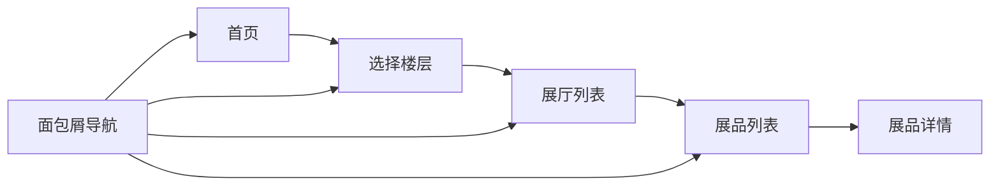

## 1. 产品概述
博物馆展陈导视网站，为参观者提供清晰的楼层导览、展厅分布和展品信息。通过面包屑导航串联参观路线，帮助用户快速定位和了解展品。

- 主要目标：解决博物馆参观路线不清晰、展品信息获取不便的问题
- 目标用户：博物馆参观者、学生、历史文化爱好者
- 产品价值：提升参观体验，增强展品信息的可及性

## 2. 核心功能

### 2.1 功能模块
1. **首页（楼层导览）**：楼层选择、博物馆概览、推荐参观路线
2. **展厅列表页**：楼层内展厅分布、房间号指引、展厅简介
3. **展品列表页**：展厅内展品卡片列表、年代/馆区筛选
4. **展品详情页**：展品详细信息、背景介绍、相关展品推荐

### 2.2 页面详情
| 页面名称 | 模块名称 | 功能描述 |
|-----------|-------------|---------------------|
| 首页 | 楼层导航 | 展示建筑楼层结构，点击切换楼层 |
| 首页 | 推荐路线 | 展示精选参观路线，一键导航 |
| 展厅列表页 | 展厅卡片 | 展示展厅名称、房间号、展品数量 |
| 展品列表页 | 展品卡片 | 展示展品图片、年代、馆区、背景简介 |
| 展品列表页 | 面包屑导航 | 显示当前位置：首页 > 楼层 > 展厅 > 展品 |
| 展品详情页 | 展品详情 | 大图展示、详细介绍、相关展品推荐 |
| 展品详情页 | 图片降级 | 图片加载失败时显示占位背景，文字信息完整保留 |

## 3. 核心流程

用户从首页开始，选择楼层后查看该楼层的展厅列表，进入展厅后浏览展品卡片，点击展品查看详细信息，通过面包屑随时回溯或跳转。

## 4. 用户界面设计

### 4.1 设计风格
- **主色调**：深褐色 `#4A3728`（博物馆木质陈列感），搭配古铜金 `#B8860B` 作为点缀
- **背景色**：米白色 `#F5F1E8`（宣纸质感），营造温润的文化氛围
- **字体**：标题使用「思源宋体」体现历史厚重感，正文使用「思源黑体」保证可读性
- **布局**：卡片式布局，留白充足，强调展品本身
- **装饰元素**：细边框、古典分隔线、轻微的纸张纹理背景

### 4.2 页面设计概述
| 页面名称 | 模块名称 | UI 元素 |
|-----------|-------------|-------------|
| 首页 | 楼层导航 | 竖向楼层列表，选中态金色高亮，hover 微上浮动画 |
| 展厅列表页 | 展厅卡片 | 矩形卡片，房间号在右上角徽章展示，底部进度条显示参观进度 |
| 展品列表页 | 展品卡片 | 图片在上文字在下，年代用标签展示，相关展品用小图横向排列 |
| 所有页面 | 面包屑导航 | 顶部固定，使用「>」分隔，可点击跳转 |
| 展品卡片 | 图片降级 | 图片加载失败时显示几何图案占位，所有文字信息正常显示 |

### 4.3 响应式
- 桌面端（1280px+）：左侧楼层导航 + 右侧内容区的双栏布局
- 平板端（768px-1279px）：顶部横向楼层导航 + 卡片网格
- 移动端（<768px）：楼层导航改为底部抽屉式，卡片单列展示
- 所有交互元素最小点击区域 44x44px

### 4.4 动效设计
- 页面切换：淡入淡出 + 轻微位移
- 卡片 hover：向上浮动 4px，阴影加深
- 面包屑：点击时背景色过渡
- 图片加载：低分辨率占位图渐变为高清图
